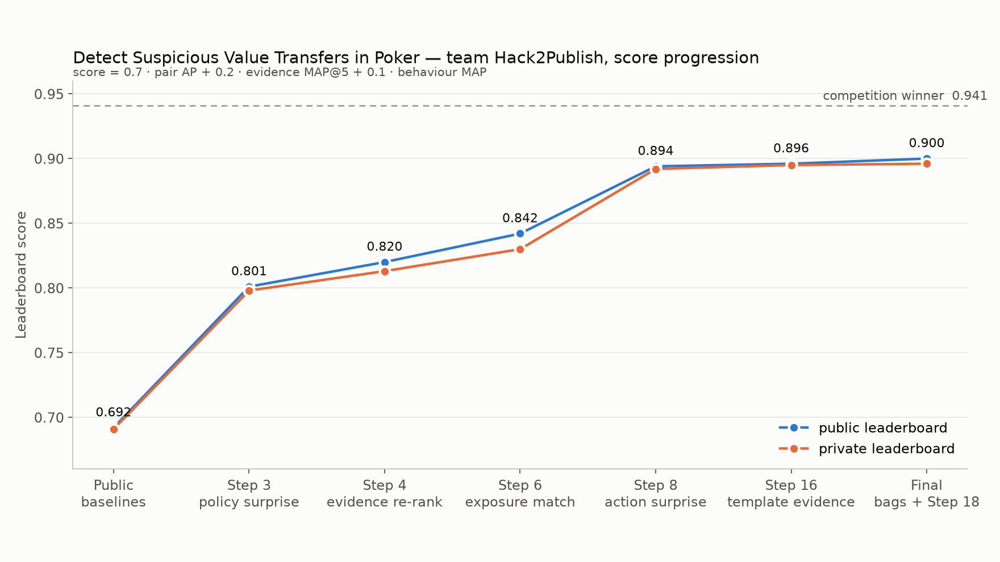
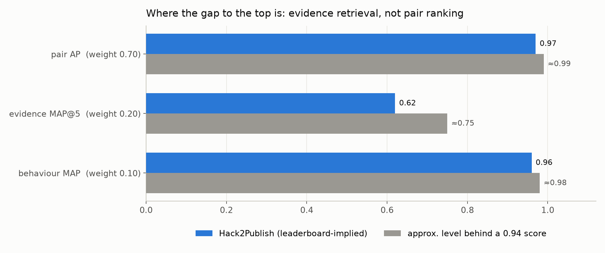
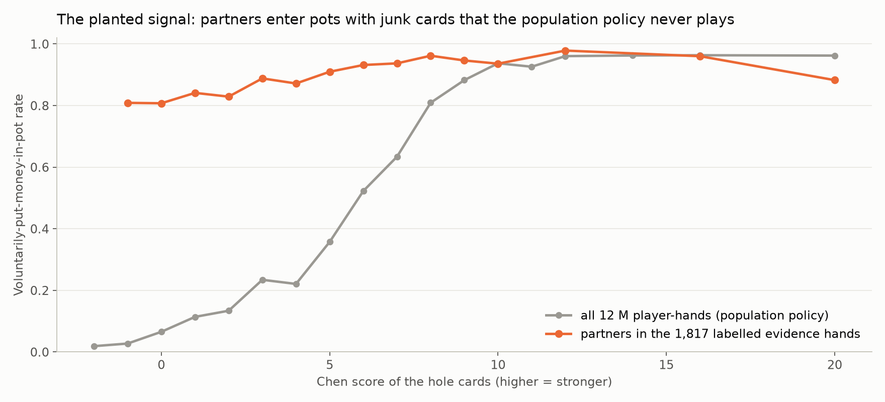

# Detect Suspicious Value Transfers in Poker — full competition record

Kaggle · host **Slash** · Sep 5 – Sep 20 2026 · 2,000,000 synthetic six-max NLHE hands, 12,000 players, 112,540 evaluation pairs
Kaggle team **Hack2Publish** · public **0.90025** · **private 0.89598 — rank 39 / 371 (top 10.5 %)**

| member | Kaggle profile |
|---|---|
| Md. Hamid Hosen | [kaggle.com/hosen42](https://www.kaggle.com/hosen42) · [github.com/hamidhosen42](https://github.com/hamidhosen42) |
| esfersami50 | [kaggle.com/esfersami50](https://www.kaggle.com/esfersami50) |
| Foysal Emon Shanto | [kaggle.com/foysalemonshanto](https://www.kaggle.com/foysalemonshanto) |

Competition page: https://www.kaggle.com/competitions/detect-suspicious-value-transfers-in-poker

## Contents

1. [Overview](#1-the-task) · [Result](#2-result) · [Method in one paragraph](#3-method-in-one-paragraph) · [Repository map](#4-repository-map) · [Rules compliance](#5-rules-compliance) · [What we learned](#6-what-we-learned-short)
2. [Part A — Solution write-up (≤ 1,500 words, as required for verification)](#part-a--solution-write-up--1500-words-as-required-for-verification)
3. [Part B — Method of the selected submissions (full technical description)](#part-b--method-of-the-selected-submissions-full-technical-description)
4. [Part C — Reproducing the selected submission](#part-c--reproducing-the-selected-submission)
5. [Part D — Five case reviews from the submitted evidence](#part-d--five-case-reviews-from-the-submitted-evidence)
6. [Part E — Experiment log: every iteration, score and lesson](#part-e--experiment-log-every-iteration-score-and-lesson)
7. [License and attribution](#license-and-attribution)


---

## Figures







---

## Leaderboard results

Final private score **0.89598** (rank 39 / 371) · public 0.90025 · winner 0.9407 private.

| submission | risk | evidence | public | private | selected |
|---|---|---|---|---|---|
| **final_J_bags20_ev18** | rank-avg of two 20-seed full-data bags (Step-8 + Step-9 features) | Step 18 | **0.90025** | **0.89598** | ✔ |
| final_H_bagsonly_ev18 | same, 10-seed bags | Step 18 | 0.90022 | 0.89603 | |
| final_G_step8heavy_ev18 | bags + CV models, Step-8 weighted 2:1 | Step 18 | 0.89950 | 0.89589 | |
| **final_F_allbag_ev18** | bags + fold-CV models, equal weights | Step 18 | 0.89964 | 0.89566 | ✔ |
| final_E_blend3_ev18 | Step-8 CV + Step-9 CV + 10-seed Step-8 bag | Step 18 | 0.89907 | 0.89565 | |
| blend8_9_16bag | as E | Step 16 | 0.89716 | 0.89499 | |
| blend89_ev16 | Step-8 CV + Step-9 CV | Step 16 | 0.89690 | 0.89454 | |
| step17_milv3 | Step 16 + phase-robust MIL hand model | Step 16 | 0.89380 | **0.89955** | not selected |
| step16 | Step-8 CV model | Step 16 | 0.89625 | 0.89503 | |
| step8 | Step-8 CV model | Step 8 | 0.89378 | 0.89159 | |
| step9 | Step-9 CV model | Step 9 | 0.89174 | 0.89113 | |
| step6 (exposure matching) | | | 0.84157 | 0.83039 | |
| step3 (first card-aware model) | | | 0.80136 | 0.79778 | |
| best public notebook re-run | | | 0.69243 | 0.69089 | |

Every final-day blend lost ≈ 0.004 from public to private — the bagging and blending gains were inside the noise of the 30 % public split. The one submission that *gained* on private, Step 17 (MIL hand model, +0.006), had trailed on the public board and was not selected, although all three development views had favoured it.

## 1. The task

Each evaluation pair (two players who shared ≥ 38 hands in the last 2,000 hands of their 30-player table) gets a `risk_score`, a `predicted_behavior` (`directed_transfer`, `soft_play`, `coordinated_isolation`, `other_coordination`, `none`) and up to five `evidence_hand_*` IDs. Score = **0.70 · pair AP + 0.20 · evidence MAP@5 + 0.10 · behaviour MAP**. The development period (first 3,000 hands per table) has 1,860 trusted labels (372 positives with ≤ 5 evidence hands each, 1,488 confirmed non-targets); every other development pair is *unknown*.

## 2. Result

| | public LB | notes |
|---|---|---|
| public baselines (chip-flow features) | 0.66 – 0.69 | |
| our Step 3 (card-conditional policy surprise) | 0.801 | first card-aware model |
| Step 8 (action-level policy surprise + hard negatives) | 0.894 | the pair model that survived to the end |
| Step 16 (+ template / family evidence re-ranker) | 0.896 | |
| **final_J** (20-seed bags + Step 18 evidence) | **0.900** | selected · private **0.896** |
| **final_F** (bags + fold-CV models + Step 18 evidence) | 0.900 | selected · private 0.896 |
| Step 17 (prank-free MIL v3) — not selected | 0.894 | private **0.900**, our best on the private set |
| leader | 0.938 | private 0.941 |

Leaderboard probes decomposed our score: pair AP ≈ 0.97, evidence MAP@5 ≈ 0.62, behaviour MAP ≈ 0.96. The gap to the leader is almost entirely evidence (they need ≥ 0.70 there); the rule that selects the 3–5 labelled evidence hands out of a pair's ~10 collusion-mode hands is the one thing we did not find.

## 3. Method in one paragraph

The simulator's bots are strictly card-driven (voluntary-entry rate 2 % → 96 % from worst to best hole cards), so coordination shows up as **two partners acting wrongly for their cards in the same hand**. We fit a 6-class behaviour clone of the population policy on all 18.6 M actions (cards, exact made-hand category, board texture, position, pot/stack ratios, raises faced, plus the player's *other-phase* style — collusion is phase-specific, so the other phase is a clean baseline) and turn every action into a surprise `−log P(action)`. Pair-hand rows (≈ 240 features: joint entries with junk, surprise when facing the partner's bet, exact-strength fold/check-down/dump flags, squeeze patterns, chip flow) are aggregated per pair (sums, top-3, with-partner vs without-partner contrasts, other-phase pair baselines, coincidence z-scores) and ranked by LightGBM trained positive–unlabelled on 2,000-hand development windows that match the evaluation exposure. Evidence is a two-stage ranker over the coordinated pairs' hands (stage 1: pair-hand features + made-hand combinations, street timing, per-player policy surprise; stage 2: top-20 pool re-ranked with family, chronology and action-sequence templates). Families come from three one-vs-rest heads gated to the top 5 % by risk. The final risk is the rank-average of two 20-seed full-data bags (Step-8 and Step-9 feature sets).

## 4. Repository map

```
step1_pipeline.py … step18_pipeline.py   one self-contained pipeline per iteration (# %% cells; jupytext renders the notebooks in deliverables_step*/)
step9_pipeline.py, step18_pipeline.py    the two pipelines the final submission is built from
hyp/                                     evidence feature families added in Step 18 (category_combo, street_timing, player_policy)
reproduce/                               bag20.py (20-seed bags), make_final.py (assembly), run_all.sh (end-to-end)
deliverables_step*/, deliverables_final/ submission CSVs and notebooks of every iteration; final_J / final_F are the selected ones
work_step3/scripts/                      analysis and ablation scripts (dev views, MIL variants, template/outsider tests, leak checks, bagging)
docs/                                    write-up, method, reproduction guide, case reviews, experiment log
public_notebook/, 18-09-26/              audits of public notebooks and repositories (nothing from a top team was public)
```
Competition data is not included (Competition Use Only); place the files in `data/`. No credentials are tracked (`token.txt` is git-ignored and was never committed).

## 5. Rules compliance

All features are computed from gameplay: hole cards, board, seats/positions, stacks, the ordered action log and chronology from `started_at`. No player metadata, ID formats, file/row ordering or generator internals are used. Unlabelled development pairs are treated as unknown.

## 6. What we learned (short)

* Card-conditional policy deviation is the signal; chip flow alone plateaus at 0.69.
* Hidden colluders in the unlabelled development set are few (~150 of 120 k); the "ambiguous" band of loose-but-honest pairs must stay in training as hard negatives.
* Matching training exposure to evaluation exposure (2,000-hand windows) is worth +0.02.
* Development metrics were unreliable for stacked hand models (a multiple-instance hand model gained on every dev view and lost 0.02 on the leaderboard: its within-pair percentile features scale with phase length); only the public leaderboard, used sparingly, settled such questions.
* Seed bagging of full-data models moved the public leaderboard by +0.0003 to +0.0007 per step — within split noise; on the private set every final-day blend landed at 0.896, i.e. those gains did not transfer.
* **Selection lesson.** Step 17 (the phase-robust multiple-instance hand model) scored 0.894 public / **0.900 private** — our best private result — but was not selected because it trailed on the public leaderboard, even though all three development views had favoured it. With a 30 % public split (≈ 150 positives, score SE ≈ 0.008) the development views were the better guide; trusting the public board over consistent development evidence cost ≈ 0.004.

---

# Part A — Solution write-up (≤ 1,500 words, as required for verification)

**Team:** Hack2Publish — Md. Hamid Hosen ([hosen42](https://www.kaggle.com/hosen42)), [esfersami50](https://www.kaggle.com/esfersami50), Foysal Emon Shanto ([foysalemonshanto](https://www.kaggle.com/foysalemonshanto))
**Selected submissions:** `final_J_bags20_ev18.csv` (public 0.90025) and `final_F_allbag_ev18.csv` (public 0.89964)
**Code:** https://github.com/hamidhosen42/Detect-Suspicious-Value-Transfers-in-Poker (see `docs/REPRODUCE.md`)

### 1. What the coordination looks like in the data

Every decision in the log is card-conditional: the population's voluntary-entry rate rises from 2 % for the weakest hole cards to 96 % for the strongest. Reading the 1,817 labelled evidence hands showed that the planted behaviour is **two partners acting "wrongly for their cards" in the same hand** — entering pots together with junk, calling the partner's bets with nothing, folding a made hand to the partner, checking a strong hand down heads-up, or raising and re-raising each other pre-flop with 7-2-type holdings to squeeze outsiders out. Chip transfer is a consequence, not the signal: chip-flow-only models plateau near 0.69.

All features are computed from gameplay only: hole cards, board, positions, stacks, the ordered action log, and hand chronology from `started_at`. No player metadata, ID formats, file order or generator internals are used.

### 2. Pipeline (three levels)

#### 2.1 Per-action policy surprise
A 6-class LightGBM "behaviour clone" of the population policy (fold / check / call / bet / raise / all-in) is trained on all 18.6 M actions from what the acting bot can see: hole cards (rank, suit, pair), exact 7-card made-hand category at the current street, board texture, position, to-call / pot / stack ratios, raises faced, own prior actions, and the player's **other-phase** style rates (VPIP, PFR, aggression, fold-to-bet, showdown rate). Because collusion is phase-specific, the other phase is a clean baseline for each player. Every action gets `surprise = −log P(taken action)`.

#### 2.2 Pair-hand features (one row per pair × shared hand)
~240 features: pre-flop policy surprise and Chen-score junk entries for both partners; exact hand strength per street and rank among the six dealt players; partner-versus-outsider responses (fold / call / raise when the partner set the price vs. when an outsider did); heads-up check-downs; squeeze patterns; chip transfer; sums, minima and maxima of action surprise, and the surprise of actions taken **while facing the partner's bet**; within-pair percentile ranks.

#### 2.3 Pair ranking (70 % of the metric)
Pair features aggregate the hand rows: means, sums, top-3 means, counts above thresholds, per-player contrasts with-partner minus without-partner (shrunk by exposure), and **other-phase pair baselines** (how the same two players play together in the phase where they are not colluding). Two design choices mattered most:

* **Exposure matching.** The evaluation phase has 2,000 hands per table (median 76 shared hands per pair) versus 3,000 in development. The pair model is trained on 2,000-hand windows of development so every count-like feature has the same scale it will have at inference.
* **Positive–unlabelled training with hard negatives kept.** Only 1,860 development pairs are labelled. A score-mixture estimate suggests roughly 150 hidden colluders among the 120 k unlabelled pairs (~0.4 % prevalence), so unlabelled pairs are used as weak negatives (weight 0.1) and, after a first pass, the ones that score like confirmed colluders become pseudo-positives. Crucially, the "ambiguous" band of loose-but-honest pairs is kept as weak negatives rather than dropped — those are exactly the negatives the leaderboard ranking has to beat (dropping them cost ≈ 0.01 AP).

The final risk is the rank-average of two 20-seed LightGBM bags trained on all development rows: one on the Step-8 feature set, one on the Step-9 set (adds coordination z-scores: observed joint-deviation counts against the independence expectation n·p₁·p₂ from each player's own field rate).

#### 2.4 Behaviour family (10 %)
Three one-vs-rest LightGBM heads on the pair features, trained on labelled positives only; the family with the highest prior-normalised probability is predicted for the top 5 % of pairs by risk, `none` for the rest (the metric treats `none` and `other_coordination` identically, and predicting a family for a false positive costs nothing extra).

#### 2.5 Evidence hands (20 %)
Two stages, trained on the coordinated pairs' hands only (labelled evidence vs. their other hands, table-grouped folds):

1. **Stage 1 ranker** on the pair-hand features plus three families added in the last two days: made-hand categories of both partners at the decisive street (who folded, whether the loser held the better hand, outsiders' categories); street timing of the partner interaction (first/last street facing each other, streets both stayed in, outsiders left); and action surprise under a **per-player** policy fitted on that player's other-phase decisions. Development MAP@5 0.528 → 0.539.
2. **Stage 2 re-ranker** on each pair's top-20 pool: pool-relative score, chronology of strong hands, the pair's family, and smoothed target encodings of the pair's ordered action-sequence template ("winner raises, loser calls, winner bets flop, loser folds to partner"). Development MAP@5 0.539 → 0.621.

Five slots are always filled (evidence is never penalised for negatives); ties in risk are removed with a 10⁻¹³ epsilon ordered by the pair's maximum hand score.

### 3. Validation

Public-leaderboard probes decomposed our score (a submission with evidence blanked scored 0.775), giving pair AP ≈ 0.97 and evidence MAP@5 ≈ 0.59–0.62 on the leaderboard, consistent with development. Three development views were tracked for every change: AP on labelled pairs, AP with all unlabelled pairs as negatives, and AP with a fixed set of 150 colluder-like unlabelled pairs counted as positives. Changes were shipped only when all views improved, and each was confirmed on the public leaderboard before being kept.

### 4. What did not work (verified)
* A multiple-instance hand model trained from pair labels: large development gains, −0.02 on the leaderboard; the cause was within-pair percentile features whose scale depends on phase length.
* Player-degree / partner-exclusivity features: a development-only artefact (unlabelled development pairs exclude labelled colluders).
* Temporal clustering or onset of the collusion, bet-size fingerprints, stack-fraction transfers, equity (EV) transfer, a common victim, first-k truncation rules for evidence labels, player metadata, graph features, family-specific pair rankers, ExtraTrees / logistic / DART ensembles.

### 5. Selected submissions
`final_J` (best public, most stable: 20 seeds per bag) and `final_F` (same evidence, risk blended with the fold-CV models — a different training regime as a hedge against private-set drift).

---

# Part B — Method of the selected submissions (full technical description)

Selected: **`final_J_bags20_ev18.csv`** (public 0.90025) and **`final_F_allbag_ev18.csv`** (public 0.89964).
Both share the same evidence lists and family labels; they differ only in how the risk vector is blended (§7).
Code: `step9_pipeline.py`, `step18_pipeline.py`, `hyp/*.py`, `reproduce/bag20.py`, `reproduce/make_final.py`.

---

### 1. Data preparation (`step18_pipeline.py` §1–2, inherited from Steps 1–8)

* **Hand chronology.** Hands are sorted by `(table_id, started_at, hand_id)`; `hand_idx` is the position within the table (0–2,999 development, 3,000–4,999 evaluation). No ID or file-order information is used.
* **Action context** (`action_context.parquet`): each action with `street_no`, `is_aggr`, amounts in big blinds and as a fraction of the pot, and `last_aggr` = the player whose bet is currently being faced (forward-filled within hand × street). `to_call > 0 and last_aggr == partner` means "facing the partner's bet".
* **Player-hand table** (`player_hands`): per (hand, player): seat, position relative to the button, hole class (169 classes) and Chen score, VPIP / PFR (action-based), pre-flop entry order, whether a raise was faced, action counts per type, showdown, net chips (bb).
* **Exact hand strength** (`player_strength`): numba 7-card evaluator (verified against the 5-card category counts) → hand value at flop/turn/river/final for all six dealt players (all hole cards are visible in this synthetic data), category (0 = high card … 8 = straight flush) and rank among the six.

### 2. Population action policy and surprise (Step 8; `step18_pipeline.py` §2a′)

A LightGBM 6-class model (fold / check / call / bet / raise / all-in) trained on a 5 M-row sample of the 18.6 M actions with:

* situation: `street_no`, position, `players_active`, `to_call_bb`, `to_call/pot`, `pot_bb`, `stack_bb`, stack-to-pot ratio, raises already made this street, own prior aggressive actions, own prior actions, action index within the street;
* private information: hole ranks (hi, lo), suited, pocket pair, exact made-hand category at the current street, board max rank, board paired, number of hole cards hitting the board, flush-card count, overpair, top-pair flags;
* player style from the **other phase** (VPIP, PFR, aggression per hand, calls per hand, fold-facing rate, showdown rate, check rate, mean pre-flop looseness/tightness surprise). Collusion is phase-specific, so the other phase is a clean style baseline.

Parameters: `learning_rate 0.1, num_leaves 127, min_data_in_leaf 200, feature_fraction 0.8, bagging 0.8, lambda_l2 5, 350 rounds` (hold-out multi-logloss 0.485). Every action gets `p_taken` and `surp = −log p_taken`. Per (hand, player): `surp_sum, surp_max, surp_pf, surp_post, n_surp2 (#actions with surprise > 2), n_surp35, surp_fold/call/aggr/check, p_min, logp_mean`.

A simpler pre-flop policy `P(vpip | hole class, position, faced raise)` (Laplace-smoothed, k = 20) from all 12 M seats gives `loose = −log P(enter)` when the player entered, `tight = −log P(fold)` when a strong hand folded, `junk_vpip = vpip · max(0, 8 − Chen)`, `vpip_resid`.

### 3. Pair-hand features (`step18_pipeline.py` §4; one row per pair × shared hand, ≈ 240 features)

* **Both players' per-hand fields** (`p1_*`, `p2_*`): everything from §1–2.
* **Joint pre-flop deviation:** both entered, both entered with junk (Chen ≤ 5), the second entrant's cards and surprise, `loose_sum/min/max`, `junk_vpip_sum/min`, `vpip_resid_sum`, `both_surprising`, `junk_raise`.
* **Action-surprise pair fields:** `surp_pair_sum/min/max`, pre-/post-flop sums, per-action-type sums, `n_surp2_sum`, `both_surp2`, `both_vpip_surp2`, `p_min_pair`, `logp_mean_sum`; and from the member perspective: surprise of actions **facing the partner** (`surp_vs_partner`, `_max`), facing an outsider, heads-up, folds/calls/raises against the partner, heads-up checks.
* **Exact-strength anatomy:** winner/loser (by net chips) categories and ranks per street, `loser_beats_winner_*`, `fold_better_hand`, `fold_better_to_partner`, `both_made_no_aggr`, `winner_weak_won`, `cat_gap_final`, `dump`, `dump_better_hand`, `checkdown`, `hu_checkdown_strong`, `hu_check_two_pair_plus`.
* **Partner interaction / squeeze:** fold/call/raise to the partner vs to outsiders, by street; outsiders' folds/calls/raises to the pair; `squeeze`, `pf_squeeze`, `squeeze_then_fold(_pf)`, `multi_call_partner`, `pair_overbets`.
* **Chip flow:** `transfer_1_to_2`, `transfer_2_to_1`, `transfer_any`, `transfer_pot_ratio`, `net_gap`, `transfer_x_call`.
* **Within-pair normalisation:** `*_to_max` and percentile ranks `*_prank` over the pair's shared hands (used by the evidence ranker; excluded from the hand models that feed the pair ranker where phase length would bias them).

### 4. Pair features and pair ranker (`step18_pipeline.py` §6; = Step 8 model)

**Aggregation** over a pair's shared hands: means (55 hand fields), maxima, top-3 means, sums; evidence-ranker score aggregates (`hs_mean/max/top3/top5/p90`, counts above the negatives' 95th/99th percentiles, `ev_n10/ev_n50` = number of hands scoring above the 10th/50th percentile of labelled evidence hands); chip-flow direction consistency and asymmetry; per-player **with-partner minus without-partner** contrasts for 17 fields, shrunk by `n/(n+25)`; **other-phase pair baselines** (`ob_*`: the same two players' joint entries, junk entries, surprise sums and transfers in the phase where they are not colluding; contrasts and ratios shrunk with `n_other/(n_other+30)`); within-table percentile ranks of the strongest 60 features. Step 9 adds coincidence z-scores: for joint events (both surprising, both junk entries, both entered), `obs − n·p₁·p₂` and `(obs − exp)/√(exp+0.5)` with each player's own field rate.

**Exposure matching.** The pair model is trained on two 2,000-hand development windows `[0, 2000)` and `[1000, 3000)` (two rows per pair) so counts and sums have the evaluation scale (median 76 shared hands vs 110 for the full 3,000-hand phase). Field baselines are phase-specific.

**Training population:** all eligible development pairs (≥ 57 shared hands ≈ the evaluation rule, no publicly-positive player) + the 1,860 labelled pairs → 122,580 pairs, 244,884 rows. Table-grouped 5-fold CV (`RandomState(42)` permutation).

**Positive–unlabelled, three stages** (LightGBM `learning_rate 0.03, num_leaves 31, min_data_in_leaf 100, feature_fraction 0.5, bagging 0.8, lambda_l2 10, 750 rounds`):
1. weights: confirmed positive 5, confirmed non-target 1, unlabelled 0.1 → OOF₁;
2. unlabelled pairs with OOF₁ ≥ 50th percentile of the labelled positives' OOF become pseudo-positives (weight 1); those ≥ 5th percentile are "ambiguous" and **kept as weak negatives (weight 0.2)** — dropping them, as Steps 3–7 did, removes exactly the loose-bot negatives the evaluation ranking must beat; → OOF₂;
3. repeat with the 25th percentile and five seeds → OOF₃ (the pipeline's risk) and the three **family heads** (one-vs-rest LightGBM, `num_leaves 7`, 400 rounds, trained on confirmed labels only).

Development views (Step 8 features): labelled AP 0.990, AP with all unlabelled as negatives 0.708, AP with a fixed set of 150 colluder-like unlabelled pairs counted positive 0.93.

### 5. Behaviour family (`predict_family`, `BEHAVIOR_RHO`)

`argmax_f P_f / prior_f` over the three heads (priors = labelled family counts 148/132/92). A family is predicted only for the top **5 %** of pairs by risk (`rho` chosen on the development population's host metric with a safety margin for higher evaluation prevalence); all others are `none`. `other_coordination` is never predicted (it scores identically to `none`).

### 6. Evidence hands (`step18_pipeline.py` §5, §5b, §5c)

Trained on the 372 coordinated pairs' 45,129 shared development hands (1,817 labelled evidence vs the rest), table-grouped folds, `HAND_PARAMS = learning_rate 0.05, num_leaves 31, min_data_in_leaf 50, feature_fraction 0.8, bagging 0.8, lambda_l2 10, 400 rounds, 2 seeds`.

**Stage 1 (Step 18 ranker)** on the §3 features **plus** three families computed by `hyp/*.py` (development and evaluation alike):
* `cc_*` (`hyp/category_combo.py`, 44 features): decisive street, who folded, outsiders active at the fold, fold-to-winner, size faced at the fold, loser/winner made-hand categories at the decisive street and per street, loser-better flags (category and kicker), showdown category gap, pocket pairs, outsiders' best category and whether it beat the pair, outsider folds/calls to the pair with better hands, family-specific flags (`cc_dt_flag`, `cc_sp_flag`, `cc_iso_junk_vs_strong`).
* `st_*` (`hyp/street_timing.py`, 53 features): first/last street the partners faced each other, streets both stayed in, heads-up streets, end street, outsiders remaining on the decisive street, first deviating street (surprise > 2), fold-gap between partners, per-street surprise maxima.
* `pp_*` (`hyp/player_policy.py`, 19 features): per-player 6-class policy fitted on **that player's own other-phase** decisions (LightGBM per 100-table chunk with situation features + the player's other-phase conditional rates + player id), scoring in-phase actions: own-policy surprise sums/max/min, `p_min`, counts with p < 0.01 / 0.05, both partners improbable in the same hand, surprise vs population surprise deltas, surprise facing the partner. Within-pair percentile versions are excluded (phase-length dependent).
Development OOF MAP@5: 0.528 → 0.539.

**Stage 2 (pool re-ranker).** For each pair the top-20 hands by the stage-1 score; features = stage-1 features + `hand_score`, score relative to the pool maximum, chronological rank in the pool, phase-relative position, gaps to neighbouring pool hands, number of pool hands within 20 hands, **strong-hand chronology** (strong hands before this one, cumulative score before, cumulative share), the pair's **family** one-hot (true in training, predicted at inference), and fold-safe **target encodings of action-sequence templates** (`tpl_pair` = the partners' ordered actions tagged winner/loser · street · facing partner/outsider/nobody · action; also pre-flop-only and first-three-token variants, each also within family; smoothing m = 10). `POOL_PARAMS = learning_rate 0.03, num_leaves 15, min_data_in_leaf 40, feature_fraction 0.7, bagging 0.8, lambda_l2 10, 500 rounds, 3 seeds`. Pool hands are ranked above all others (`10 + score₂`, else score₁). Development OOF MAP@5: 0.539 → **0.621** (directed_transfer 0.65, soft_play 0.65, coordinated_isolation 0.53).

Five slots are always filled; ties are broken by pot size then hand id, as the host metric does.

### 7. Final assembly (`reproduce/bag20.py`, `reproduce/make_final.py`)

| vector | source |
|---|---|
| `b8` | 20-seed full-data LightGBM bag (seeds 42…269), Step-8 pair features, labels/weights from the stage-3 PU recipe applied to the Step-18 CV OOF |
| `b9` | same with Step-9 pair features and the Step-9 OOF |
| `c8`, `c9` | the fold-CV ensembles (5 folds × 5 seeds) from `step18_pipeline.py` / `step9_pipeline.py` |

* **final_J:** `risk = rank(b8) + rank(b9)` averaged; ties resolved by mean probability then a 10⁻¹³ epsilon (no two pairs equal).
* **final_F:** `risk = rank(c8) + rank(c9) + rank(b8₁₀) + rank(b9₁₀)` averaged (the 10-seed halves of the bags), i.e. 50 % weight on the fold-CV regime as a hedge.
* Both: families from the Step-18 heads gated at the top 5 % of the blended rank; evidence from Step 18.

### 8. Validation and leaderboard decomposition

* Three development views per change (labelled AP, pessimistic AP, hidden-150 AP); a change was kept only if all improved and the public leaderboard confirmed it.
* Probe submission (Step 8 risk with all evidence blanked): 0.77519 → evidence MAP@5 on the leaderboard = (0.89378 − 0.77519)/0.2 = 0.593; with Step 18 evidence ≈ 0.62; implied pair AP ≈ 0.97.
* Public/private split is 30/70 stratified by family; simulation of random splits gives a public–private score SD of ≈ 0.01 for every candidate, an order of magnitude larger than the differences among our top candidates (see `work_step3/final_selection_report.md`).

---

# Part C — Reproducing the selected submission

Selected submission: `deliverables_final/final_J_bags20_ev18.csv` (public 0.90025). The second selection, `final_F_allbag_ev18.csv`, uses the same evidence and a risk blend that additionally includes the fold-CV models written by `step18_pipeline.py` (see the end of this file).

### Environment
* Python 3.12; `polars >= 1.0`, `pandas`, `numpy`, `lightgbm >= 4`, `numba`, `scikit-learn`, `scipy`, `jupytext` (only to render notebooks).
* ~24 GB RAM, 10 CPU cores; total wall time ≈ 6–8 h. All stages cache to `POKER_WORK_DIR` and are skipped when their outputs exist.
* Competition files (`hands.parquet`, `seats.parquet`, `actions.parquet`, `players.parquet`, `development_labels.csv`, `development_evidence.csv`, `evaluation_pairs.csv`, `sample_submission.csv`) in `POKER_DATA_DIR` (default `data/`). `players.parquet` is read but no feature is derived from it.

### One command
```bash
POKER_DATA_DIR=data POKER_WORK_DIR=work_step3 bash reproduce/run_all.sh
```
writes `final_submission.csv`, identical in structure to `deliverables_final/final_J_bags20_ev18.csv` (LightGBM seeds are fixed; floating-point differences across machines can move a few risk values in the 6th decimal).

### What the steps do
| step | script | outputs (in `POKER_WORK_DIR`) |
|---|---|---|
| 1 | `step9_pipeline.py` | shared caches: `action_context`, `player_hands_*`, action-policy model → `action_surprise`, `player_hand_surprise`, hand strength, pair-hand maps, pair-hand features `dev_hand_features_v9_*` / `eval_hand_features_v9`, pair features `dev_pair_features_v9` / `eval_pair_features_v9`, pair-model OOF `dev_oof_v9` |
| 2 | `hyp/category_combo.py`, `hyp/street_timing.py`, `hyp/player_policy.py` (development, then evaluation) | evidence-ranker feature families in `hyp/` and `hyp/eval/` |
| 3 | `step18_pipeline.py` | Step 8 pair-hand/pair features (`*_v8`), the Step 8 pair model and family heads (`dev_oof_v18`, `eval_pair_features_v18`, `eval_risk_v18`), the two-stage evidence ranker, and `submission.csv` (its evidence columns are the final ones) |
| 4 | `reproduce/bag20.py` | 20-seed full-data bags of the two pair rankers: `final_bag20_step8.parquet`, `final_bag20_step9.parquet` |
| 5 | `reproduce/make_final.py` | rank-average of the two bags → `risk_score`; family heads from `eval_risk_v18` gated at the top 5 %; evidence from step 3 → `final_submission.csv` |

The notebooks in `deliverables_step*/` are `jupytext` renderings of the same scripts (`jupytext --to ipynb step18_pipeline.py`).

### Rules compliance
* Features use only gameplay: cards, board, positions, stacks, the ordered action log and hand chronology (`started_at`). Hand position within a phase (`hand_idx`) is derived by sorting `started_at`, never from IDs or file order.
* No use of ID formats, row/file ordering, `players.parquet` attributes, or anything about the generator.
* Unlabelled development pairs are treated as unknown (weak negatives / pseudo-positives), as the host clarified.

### `final_F` (second selection)
`final_F_allbag_ev18.csv` = rank-average of four risk vectors — the two 10-seed halves of the bags above and the fold-CV pair models from `step18_pipeline.py` (`eval_risk_v18.risk`) and `step9_pipeline.py` (`eval_risk_v9.risk`) — with the same evidence and family rule. Its construction is the `build("final_A_allbag_equal", ...)` call in the session script `work_step3/scripts/` (recorded in git); it differs from `final_J` only in the risk blend weights.

---

# Part D — Five case reviews from the submitted evidence

Each review lists the pair, its risk rank in our submission, the five submitted evidence hands, what is observable in the log, and a plausible benign explanation. Cards are as recorded in `seats.parquet`; "P1/P2" are the pair's `player_1`/`player_2` from `evaluation_pairs.csv`. All amounts are chips; blinds are given per hand.

---

### Case 1 — `P8FA9939F1886` (rank 1, predicted `directed_transfer`)
Players `U73C3EEF1BEAB` (P1) / `UA25B1D20ECFE` (P2), 99 shared evaluation hands.
Evidence: `HDBA527F2C2D221`, `HD9EB30F28B5458`, `HA08CD42774F1F5`, `H950EF8646547F1`, `HE8DFAF2396BF2B`.

**Observable behaviour.** In every listed hand P1 commits a large share of the stack to P2 with a hopeless holding, and P2 is the sole beneficiary.
* `HDBA527F2C2D221` (bb 2): P1 calls from the big blind with 8♥3♥, check-calls the flop, bets 46 on the turn with 8-high (board 6♦4♥T♠4♣), calls P2's raise to 208, then shoves the river for 78 into P2's 7♥7♠. P1 loses the entire 299 stack; P2 +304.
* `HD9EB30F28B5458` (bb 2): P1 calls P2's 3-bet with Q♠7♠, then calls 27, 89 and an all-in on 5♣4♠K♥T♦T♣ with queen-high against K♦J♠. P1 −240.
* `HA08CD42774F1F5` (bb 2): P1 calls two re-raises pre-flop (12, then 95) with 4♥3♦ behind P2's raises, and folds the flop to P2's shove. P1 −109, P2 +157.
* `H950EF8646547F1` (bb 2): P1 bets and then shoves three streets with A♦2♠ into P2's A♠9♠ on Q♠A♣6♣T♠3♣; P1 −170.
* `HE8DFAF2396BF2B` (bb 2): P1 calls a raise with 6♣5♥, check-folds the flop to P2.
Over the 99 shared hands, 526 big blinds move from P1 to P2 and 148 the other way (net P1 −378 bb, P2 +387 bb). With P2 at the table P1 enters 33 % of pots and 20 % of hands with junk cards; without P2, 24 % and 6 % — P1's play against outsiders is ordinary.

**Plausible benign alternative.** P1 could simply be a very loose, bluff-heavy player who happens to run into P2's strong hands: the 8-high turn bet and river shove in `HDBA527F2C2D221` are the kind of bluff a reckless player makes against anyone, and A2 vs A9 (`H950EF8646547F1`) is a common dominated-ace cooler. Individually, each hand is explainable as bad play; it is the repetition, the one-directional flow, and the contrast with P1's play against outsiders that make coordination the more likely reading.

---

### Case 2 — `PAE6DC4BF00FE` (rank 9, predicted `soft_play`)
Players `UB56EF3A5E19A` (P1) / `UB8D99E5B936F` (P2), 119 shared hands.
Evidence: `H715D63EA5BFD96`, `H49C4C83639A21E`, `H0466DD13AAD8F6`, `HF013A54C234011`, `HF3315B7996E692`.

**Observable behaviour.** Heads-up against each other, P1 declines to bet made hands and folds them to small bets.
* `H715D63EA5BFD96` (bb 4): P1 limps 9♠9♥ (a hand the population raises), flops a **set of nines** on 5♦T♦9♣, checks the flop and turn heads-up against P2, and folds the river to a 2-big-blind bet. P2 wins with T♣8♥.
* `H49C4C83639A21E` (bb 4): P1 raises K♠9♠, flops a pair of nines on 5♥8♥Q♠, checks three streets and folds to P2's 20-chip river bet; P2 holds J♥A♦ (no pair).
* `H0466DD13AAD8F6` (bb 4): P1 and P2 check every street to showdown (2♦2♥3♥5♠T♥); P2's 8♣8♠ wins a pot that never grows.
* `HF013A54C234011` (bb 4): P1 calls P2's bets on all three streets with T♦J♠ (second pair on K♥Q♣5♣5♠T♥) and pays off 266 to P2's A♣Q♠.
* `HF3315B7996E692` (bb 4): multi-way; the partners check together on the flop and both fold to an outsider.
Pots between the partners either stay minimal (mutual checking, folding sets and pairs) or, when P2 bets, P1 calls down and loses; P1 never wins a meaningful pot from P2 in the shared hands.

**Plausible benign alternative.** P1 may be a tight-passive player who slow-plays sets and pairs and folds to any river aggression regardless of opponent, and two passive players will often check hands down. The set-of-nines fold for two big blinds is extreme but is a single hand; the check-downs (`H0466DD13AAD8F6`) are common between passive players and would not be suspicious on their own.

---

### Case 3 — `P063AEE30B6A8` (rank 8, predicted `coordinated_isolation`)
Players `U0D9E9B605C76` (P1) / `UD45A5F2A67BC` (P2), 95 shared hands.
Evidence: `H9F48475CB65CE2`, `H7D5E4AF2B28B0E`, `HC33F4F889C651D`, `HBD0544815956A5`, `H4F2E56049F11BB`.

**Observable behaviour.** The pair raises and re-raises each other pre-flop with junk to push outsiders out, then one partner folds to the other.
* `H9F48475CB65CE2` (bb 4): P1 opens 3♦4♣ to 9, P2 3-bets K♣T♥ to 27, an outsider 4-bets A♥K♦ to 70; both partners fold.
* `HC33F4F889C651D` (bb 4): P1 opens A♦6♠ to 12, P2 3-bets **9♦2♦** to 36, the four outsiders fold, P1 folds. P2 wins 18.
* `HBD0544815956A5` (bb 4): P1 opens 6♠2♦, P2 3-bets 8♦2♣ to 28, an outsider calls, P1 4-bets to 90 with 6-2 offsuit, P2 folds, the outsider calls and bets the flop; P1 folds (−98).
* `H7D5E4AF2B28B0E` (bb 4): P2 opens 7♦3♣ to 12 and takes the blinds.
* `H4F2E56049F11BB` (bb 4): P1 opens A♠J♣, P2 folds, an outsider re-raises twice and P1 folds.
Three-bets and four-bets with 9-2, 8-2 and 6-2 between the same two players, followed by a fold to the partner once outsiders are gone, recur throughout the shared hands.

**Plausible benign alternative.** Two hyper-aggressive players who 3-bet and 4-bet light against every opener would produce the same raise-fold cycles, and `HBD0544815956A5` in fact costs the pair 126 chips to an outsider, which is what you would expect from reckless aggression rather than coordination. The pattern is only suspicious because it is concentrated on hands where the two are in the pot together.

---

### Case 4 — `P8698759D2395` (rank 250, predicted `coordinated_isolation`)
Players `U3EF56F211745` (P1) / `U52952C699E3B` (P2), 50 shared hands.
Evidence: `HBC05929C497F6F`, `H79C01885E6B1A0`, `H9BE917B77C8489`, `HCA7E700AFB342E`, `H5E3E4AF27D7877`.

**Observable behaviour.** Both partners open-raise very weak hands and re-raise each other pre-flop.
* `HBC05929C497F6F` (bb 2): P2 opens 9♥5♣ to 5 and takes the blinds.
* `H5E3E4AF27D7877` (bb 2): P1 opens T♠3♦ to 4 and takes the blinds.
* `H9BE917B77C8489` (bb 2): P2 opens Q♠7♥; an outsider 3-bets and both partners fold.
* `H79C01885E6B1A0` (bb 2): P2 opens J♥9♠, P1 3-bets 8♥8♣, everyone including P2 folds.
* `HCA7E700AFB342E` (bb 2): P2 opens A♦7♦, P1 3-bets A♠K♥, an outsider calls, P2 4-bets to 30 with A-7, the outsider 5-bets 8♥8♣, P1 shoves, the outsider calls, P2 folds. P1 loses 200 to the outsider's 9♦4♦ (a rivered flush on Q♥6♠5♦T♦J♦); P2 −36.

**Plausible benign alternative.** With only 50 shared hands this is a weak case, and our model ranks it accordingly (250th). Opening 95o/T3o/Q7o and 4-betting A7 suited are consistent with two ordinary loose-aggressive players; the isolation attempt in `HCA7E700AFB342E` backfires against a third player, which is at least as consistent with independent aggression as with coordination.

---

### Case 5 — `P1944BCEB32C8` (rank 450, predicted `directed_transfer`)
Players `U4715F363D43C` (P1) / `U69D0BEF5871D` (P2), 160 shared hands.
Evidence: `H7B727FBC6EBAB2`, `HB613D24BED4EF7`, `HF3C572F01DFD65`, `H888B9D10B6DD99`, `HCE7BA51652C427`.

**Observable behaviour.** P2 repeatedly enters pots against P1 with junk and calls large bets with nothing; P1 holds a strong hand each time.
* `H7B727FBC6EBAB2` (bb 2): P2 opens T♠6♥, calls P1's 3-bet, then calls 25, 29 and 94 with ten-high on 3♥4♣A♦3♠7♠ against K♥K♣. P2 −161.
* `HB613D24BED4EF7` (bb 2): P2 calls with 3♠T♥, calls a flop check-raise to 76 with ten-high on A♦4♣8♦, bets the turn, and calls the river all-in; loses the whole 138 stack to P1's pair of fours.
* `HF3C572F01DFD65` (bb 2): P2 calls with 7♣8♦, calls flop and turn, then raises the river to 86 on 3♥4♥4♦3♠4♠ (playing the board) into P1's A♣A♦. P2 −113.
* `H888B9D10B6DD99` (bb 2): P2 calls down three streets with 4♦6♦ (pair of sixes) against P1's A♦8♥ on 6♣7♣Q♣T♦9♦.
* `HCE7BA51652C427` (bb 2): P2 calls a 3-bet with J♦3♥, bets the flop and folds to P1's raise (−33).
Over the 160 shared hands 325 big blinds move from P2 to P1 and 18 the other way. P2 calls 0.31 times per hand when P1 is dealt in versus 0.18 without P1; the junk-entry rate is similar in both settings (20 % vs 18 %), which is why the contrast is weaker than in Case 1.

**Plausible benign alternative.** P2 could be a calling-station bot that pays off anyone with any holding; every one of these hands is an ordinary bad call, and P1 simply had the goods. The model's lower rank (450) reflects that the with-partner versus without-partner contrast is weaker here than in Cases 1–3.

---

# Part E — Experiment log: every iteration, score and lesson

Public leaderboard scores (team submissions). "Dev" numbers are our development views: labelled AP / pessimistic AP (all unlabelled as negatives) / evidence MAP@5.

| step | date | public | change | lesson |
|---|---|---|---|---|
| public notebooks | Sep 7–16 | 0.55–0.69 | chip-flow features, seat/graph features | plateau at 0.69 regardless of model; chip flow is a consequence, not the signal |
| Step 1 | Sep 15 | 0.671 | evidence-first PU baseline | evidence MAP 0.39 |
| Step 2 | — | not submitted | exact 7-card strength, fold-the-better-hand, squeeze flags | superseded by Step 3 |
| Step 3 | Sep 16 | 0.801 | **card-conditional pre-flop policy surprise**, two-step PU on all eligible pairs, `none` rule | the planted signal is both partners entering with junk |
| Step 4 | Sep 16 | 0.820 | evidence stage-2 pool re-ranker, planted-hand counts, third PU round | evidence 0.51 → 0.58 |
| Step 5 | Sep 16 | 0.824 | other-phase pair baselines | small gain |
| Step 6 | Sep 16 | 0.842 | **exposure matching** (2,000-hand training windows), phase-relative pool index | +0.02; scale of count features matters |
| Step 7 | Sep 17 | 0.822 | field baselines pooled over both phases, 3 windows | regression: phase-specific baselines are what isolate phase-specific collusion |
| Step 8 | Sep 17 | **0.894** | **action-level behaviour-clone policy surprise**; ambiguous PU band kept as weak negatives | +0.052; only ~150 hidden colluders in 120k unlabelled pairs |
| probe | Sep 17 | 0.775 | Step 8 with evidence blanked | LB evidence = 0.593, pair AP ≈ 0.97 |
| Step 9 | Sep 18 | 0.892 | coincidence z-scores, family/chronology in stage 2 | neutral on pairs, evidence +0.006 |
| Step 10 | — | not submitted | transductive PU on evaluation pairs | dev views down; not pursued |
| Step 11–13 | Sep 18 | 0.873 (Step 12) | multiple-instance hand model from pair labels + template target encodings | big dev gains, −0.02 LB: MIL relied on within-pair percentile features whose scale depends on phase length |
| Step 14–15 | Sep 18 | 0.872 / 0.854 | leave-table-out eval scoring; within-phase percentiles | did not fix it |
| Step 16 | Sep 19 | 0.896 | Step 8 pair model + template/family evidence re-ranker | evidence transfers (+0.002) |
| Step 17 | Sep 19 | 0.894 | prank-free MIL v3 | dev up, LB flat → MIL abandoned |
| blend89_ev16 | Sep 19 | 0.897 | rank-average Step 8 + Step 9 risk | ensembling works |
| blend3 | Sep 19 | 0.897 | + 10-seed Step 8 bag | |
| blend4 | Sep 19 | 0.894 | + family-specific rankers | hurt on LB (dev hidden-150 view misled) |
| hypothesis sweep | Sep 19 night | — | 8 evidence-label hypotheses in parallel (equity transfer, per-player policy, bet-size grid, provability, stack fractions, made-hand combos, joint p-values, street timing) | three verified on two fold permutations × three seeds |
| Step 18 | Sep 20 | (in E–J) | evidence stage 1 + made-hand combos, street timing, per-player policy | dev evidence 0.613 → 0.621, LB +0.002 |
| final_E | Sep 20 | 0.899 | blend3 risk + Step 18 evidence | |
| final_F | Sep 20 | 0.900 | 8cv + 9cv + 8bag + 9bag + Step 18 evidence | **selected** |
| final_G | Sep 20 | 0.900 | Step-8-heavy weights | neutral |
| final_H | Sep 20 | 0.900 | 10-seed bags only | full-data bags > CV models |
| final_J | Sep 20 | **0.900** | 20-seed bags only | **selected**; bagging saturated |

### Dead ends (verified, do not repeat)

**Evidence label rule.** Chronological first-k truncation; temporal clustering / onset / bursts / seating sessions; seat position and relative position; stack sizes and stack-fraction transfers; hand duration and timestamps; a common victim outsider; bet-size distributions and grids; action-mix fingerprints; success-of-mechanism first-k; equity (EV) transfer; joint action p-values per street; outsider strength (+0.008 only); template target encoding (+0.02, used). The labelled evidence hands are statistically interchangeable with a pair's other collusion-mode hands on every observable we tried; the leader's ≥ 0.70 evidence MAP implies a rule we did not find.

**Pair ranking.** Player-degree / partner-exclusivity features (a development-only artefact: unlabelled dev pairs exclude labelled colluders); family-specific rankers; exposure-weighted blends; ExtraTrees / quantile-logistic / DART and their blends; excluding or pseudo-labelling the top unlabelled pairs; dropping low-exposure training rows; symmetric p1/p2 augmentation; player metadata; the three MIL variants.

### Tooling notes
* Local runs: Apple M-series 10 cores, 26 GB RAM; full pipeline ≈ 90 min (policy model +30 min), all stages cached in `work_step3/`.
* Development-set metrics for stacked hand models are unreliable; the public leaderboard (5 submissions/day, shared across the team) was the only decisive validation, used one change at a time.

---

# License and attribution

Copyright © 2026 Kaggle team **Hack2Publish**: Md. Hamid Hosen ([kaggle.com/hosen42](https://www.kaggle.com/hosen42)), [kaggle.com/esfersami50](https://www.kaggle.com/esfersami50) and Foysal Emon Shanto ([kaggle.com/foysalemonshanto](https://www.kaggle.com/foysalemonshanto)).

**Code** (`*.py`, `hyp/`, `reproduce/`, `work_step3/scripts/`, and the notebooks in `deliverables_*/`) is released under the MIT License:

> Permission is hereby granted, free of charge, to any person obtaining a copy of this software and associated documentation files (the "Software"), to deal in the Software without restriction, including without limitation the rights to use, copy, modify, merge, publish, distribute, sublicense, and/or sell copies of the Software, and to permit persons to whom the Software is furnished to do so, subject to the following conditions: the above copyright notice and this permission notice shall be included in all copies or substantial portions of the Software. THE SOFTWARE IS PROVIDED "AS IS", WITHOUT WARRANTY OF ANY KIND, EXPRESS OR IMPLIED, INCLUDING BUT NOT LIMITED TO THE WARRANTIES OF MERCHANTABILITY, FITNESS FOR A PARTICULAR PURPOSE AND NONINFRINGEMENT. IN NO EVENT SHALL THE AUTHORS OR COPYRIGHT HOLDERS BE LIABLE FOR ANY CLAIM, DAMAGES OR OTHER LIABILITY, WHETHER IN AN ACTION OF CONTRACT, TORT OR OTHERWISE, ARISING FROM, OUT OF OR IN CONNECTION WITH THE SOFTWARE OR THE USE OR OTHER DEALINGS IN THE SOFTWARE.

**Documentation** (this README and `docs/`) is released under [CC BY 4.0](https://creativecommons.org/licenses/by/4.0/): reuse with attribution to the authors and a link to this repository.

**Competition data** is not included and is not covered by these licenses. It is provided by Slash under the competition's "Competition Use Only" terms; cite the competition as: *Slash — Detect Suspicious Value Transfers in Poker. Kaggle, 2026. https://www.kaggle.com/competitions/detect-suspicious-value-transfers-in-poker*

Parts of the analysis and code were developed with the assistance of Claude (Anthropic); all design decisions, experiments and submissions were run and verified by the team.
